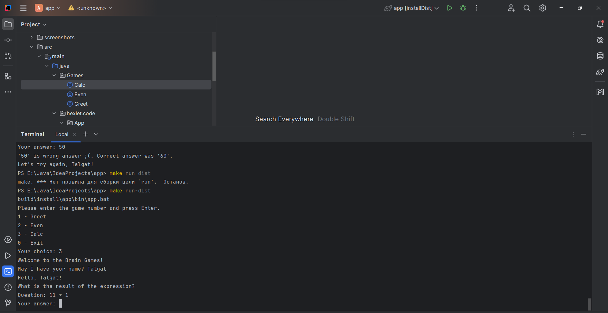

### Запуск игры Event

### Победа

### Поражение

### Запуск игры Calc

### Победа

### Поражение

### Запуск игры GCD

### Победа

### Поражение

### Запуск игры Progression

### Победа

### Поражение

### Запуск игры Prime

### Победа

### Поражение
